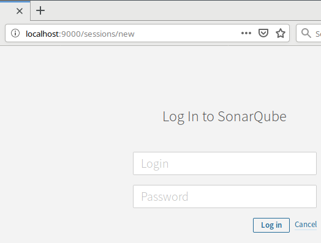
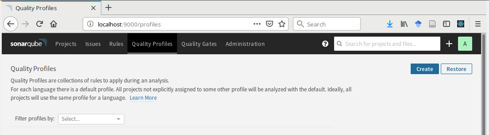
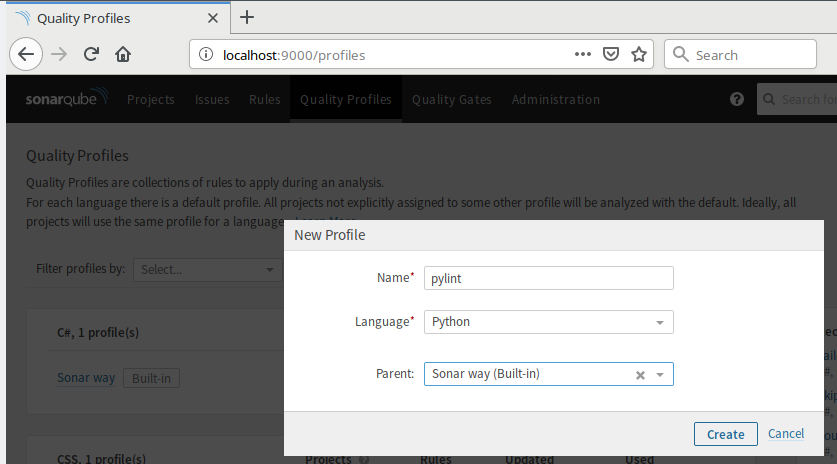
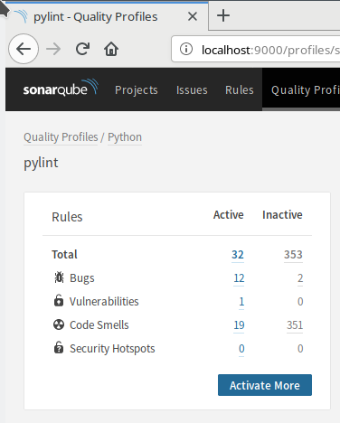
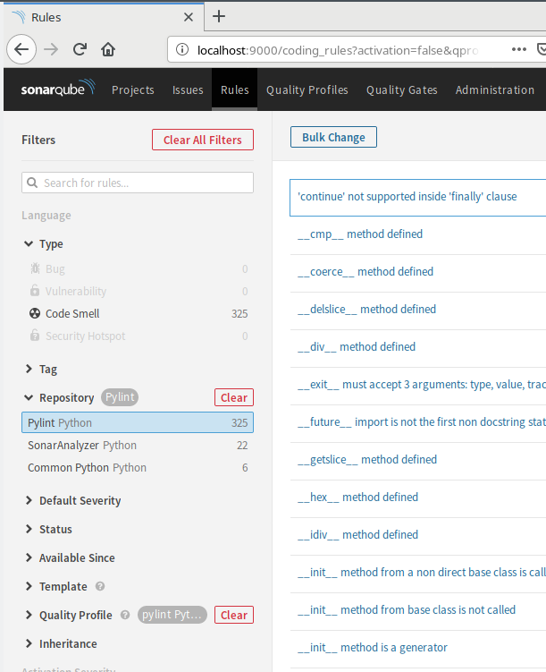
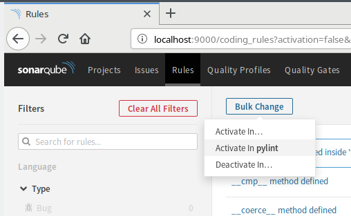
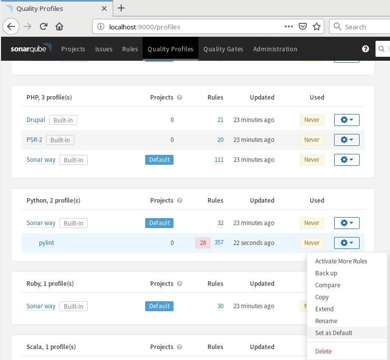
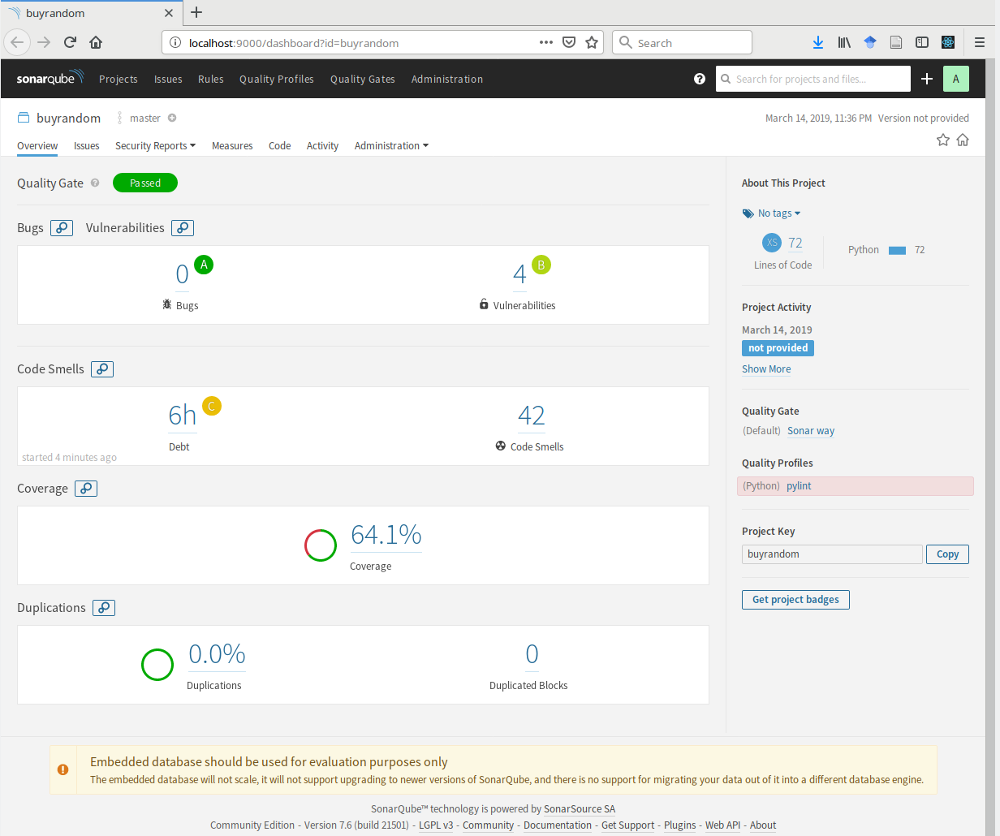

# pycodeq
How to do code analysis with sonarqube for python projects.

Code quality is often associated with a set of standard code metrics.

This little guide is about using the tools from sonar to keep track of code
metrics when working with python based projects. The sonar tools are the 
sonarqube server and the sonar code scanner. This guide is also about the 
specific python tools to actually calculate the code metrics.

## Sonarqube & sonar-scanner
Sonarqube is a web server capable of keeping track of various code metrics as:

+ technical debt (how much of your code is not documented)
+ code smells (known code patterns that are usually bad practice), 
+ code coverage (how much of your code is tested)
+ security (how many known security flaws are detected)

Sonarqube is a server that will keep track of the different metrics (in
a database) and has a web interface. The web interface keeps track of metrics
for different projects, each project having it's own place and configuration.
There are some dashboards present in the server as default, but they can be 
refined and new ones can be created.

### Usage scenarios
If you are collaborating in a software project where python is used, you can 
use sonarqube to analyse the code of the project, at different moments, and at
different places. You can calculate your code metrics _before_ creating a
commit, or you can wait for the commit to be pushed to the repository, and let
code reviews and continuous integration do it. We can consider that if you
do the analysis before a commit, it is *local*, and that an analysis done after
the commit is pushed, is *remote*. 

When using sonarqube as the server that keeps track of the metrics, you need
a tool to go over your code, and run the different tools that will calculate
the metrics. In the sonar ecosystem, this tool is the sonar-scanner. It is 
capable of calculating itself some of the metrics, depending on the language,
but for python, some of the most important metrics are actually calculated
with third party tools like *pytest*, *bandit* and *pylint*.

### Flow

If you read up to here, you know that:

> There is a *client* (sonar-scanner) - *server* (sonarqube)  architecture

> There are two usage scenarios: local (pre-commit analysis) and remote

Putting all in practice requires installing sonar-scanner in your development
machine, and a running sonarqube server.

For the *local* scenario, this guide will consider using a container to run
the sonarqube server. For the *remote* one, we will use a github app linked to
a repository.

## Requirements

### Sonar-scanner

Please install `sonar-scanner`. This should be a simple thing to do in this 
century, but I can't guarantee that (myself being born in the previous century).
The [sonar-scanner website](https://docs.sonarqube.org/display/SCAN/Analyzing+with+SonarQube+Scanner)
basically only provides an archive (zip, tar, you name it) and asks you to
update your PATH environment variable. 

> In linux, you don't really have to mess with your PATH variable if you don't 
> want to do it. You can safely expand the archive (to /usr/share, or your home
> directory) and invoke the sonar-scanner command directly. 

You can install `sonar-scanner` in linux by issuing:

```bash
# the exact URL comes from the sonar-scanner website
cd ~/Downloads
wget "https://binaries.sonarsource.com/Distribution/sonar-scanner-cli/sonar-scanner-cli-3.3.0.1492-linux.zip"
sudo unzip sonar-scanner-cli-3.3.0.1492-linux.zip -d /opt
```

After expanding the zip file, you must add the `/opt/sonar-scanner-3.3.0.1492-linux/bin/`
to your path. You can do this _permanently_ by editing your shell configuration
(`.bashrc` or `.zshrc`) or temporarily. 

```zsh
export PATH=$PATH:/opt/sonar-scanner-3.3.0.1492-linux/bin/
```

Test that it works by invoking `sonar-scanner` in your terminal. You should 
see something like:

```bash
[tomas@pc pycodeq]$ sonar-scanner
Picked up _JAVA_OPTIONS: -Dawt.useSystemAAFontSettings=on
INFO: Scanner configuration file: /opt/sonar-scanner-3.3.0.1492-linux/conf/sonar-scanner.properties
INFO: Project root configuration file: NONE
INFO: SonarQube Scanner 3.3.0.1492
INFO: Java 1.8.0_121 Oracle Corporation (64-bit)
INFO: Linux 4.20.13-200.fc29.x86_64 amd64
INFO: User cache: /home/tomas/.sonar/cache
ERROR: SonarQube server [http://localhost:9000] can not be reached
INFO: ------------------------------------------------------------------------
INFO: EXECUTION FAILURE
INFO: ------------------------------------------------------------------------
INFO: Total time: 0.440s
INFO: Final Memory: 5M/234M
INFO: ------------------------------------------------------------------------
ERROR: Error during SonarQube Scanner execution
ERROR: Unable to execute SonarQube
ERROR: Caused by: Fail to get bootstrap index from server
ERROR: Caused by: Failed to connect to localhost/0:0:0:0:0:0:0:1:9000
ERROR: Caused by: Connection refused (Connection refused)
ERROR: 
ERROR: Re-run SonarQube Scanner using the -X switch to enable full debug logging.
```

## Sonarqube

### Local container

Get [docker ce installed](https://docs.docker.com/install/) in your development
machine.

Once you have docker up and running (you managed to do the hello-world test),
get a copy of the sonarqube image with:

```bash
docker pull sonarqube
```

Launch a container of this image, making sure you expose port 9000 to the outside:

```bash
docker run -d --rm --name sonarqube -p 90000:9000 sonarqube
```

the `-d` flag is there to make the container run in the background (maybe
during your development phase). Please notice that the start time of the server
is not exactly quick. Allow some little time before pointing your web-browser
to [your local sonarqube](http://localhost:9000/).

> If you want to make sure you will not forget to shut down the container
> before leaving your development session, run the container without the `-d`
> flag, but this will block your terminal session.

> If you ran the container in using the `-d` flag, you can attach to the 
> container logs by issuing `docker logs -f sonarqube`. This can be useful
> to see when the server is completely operational. 

#### admin admin

Once the sonarqube server is up and running, you are _almost_ ready to execute 
`sonar-scanner` inside the directory of your project. The default image of
`sonarqube` does not have the pylint rules activated by default. We must
activate them before doing an analysis.
[See here for the issue](https://community.sonarsource.com/t/pylint-and-qualityprofile/5462/9) 

### Activate pylint rules

Since we are going to change things in the sonarqube server, login as admin.
Yes, the password is also `admin`.



To activate the pylint rules inside sonarqube, create a new "quality profile" 

 

with a descriptive name (pylint), for python, and make it inherit from the profile 
called "Sonar way".



Add more rules than the ones of "Sonar way" to the new quality profile.



Then activate the pylint "repository" 



and "bulk add" those rules to your new profile




After that, make your newly created quality profile the default for your 
python projects.




From the server side, this is it, you are ready. The next step is to add a
configuration file in your code for the `sonar-scanner`. But before doing this,
we must calculate the code metrics, and only after that we will upload them
using `sonar-scanner` to the `sonar-qube` server.

## Local metrics

We will consider creating the metrics for:

+ *security* using [bandit](https://github.com/PyCQA/bandit)
+ *code coverage* using pytest 
+ *code smells and errors* using pylint

### Bandit

install bandit with the regular `conda` /  `pip` install.

run bandit with:

```bash
bandit --format json --output bandit-report.json --recursive my_library
```
### Code coverage

You already have your `tests` directory and have already installed pytest.
Then, run:

```bash
pytest --cov=my_library --cov-report xml:coverage-reports/coverage-my_library.xml tests
```
to create a coverage report parseable by `sonar-scanner`.

### code smells

You already have pylint installed, then run:
```bash
pylint my_library -r n --msg-template="{path}:{line}: [{msg_id}({symbol}), {obj}] {msg}" > pylint-report.txt
```


## Executing sonar-scanner

Create a file called `sonar-project.properties` at the top of the project.
You can safely start with the following contents:

```
sonar.projectKey = my_library 
sonar.sources = my_library
sonar.language =  py
sonar.python.xunit.reportPath = pytest-report.xml
sonar.python.bandit.reportPaths = bandit-report.json

sonar.python.pylint.reportPath = pylint-report.txt

```
Now that the metrics have been calculated, you can run `sonar-scanner` in your
project directory, and if all goes well, you will see open your project in `sonarqube`
and see the results of the analysis.


```bash
/opt/sonar-scanner-3.3.0.1492-linux/bin/sonar-scanner
INFO: Scanner configuration file: /opt/sonar-scanner-3.3.0.1492-linux/conf/sonar-scanner.properties
INFO: Project root configuration file: /home/tomas/buyrandom/sonar-project.properties
INFO: SonarQube Scanner 3.3.0.1492
INFO: Java 1.8.0_121 Oracle Corporation (64-bit)
INFO: Linux 4.20.13-200.fc29.x86_64 amd64
INFO: User cache: /home/tomas/.sonar/cache
INFO: SonarQube server 7.6.0
INFO: Default locale: "en_GB", source code encoding: "UTF-8" (analysis is platform dependent)
INFO: Load global settings
INFO: Load global settings (done) | time=123ms
INFO: Server id: BF41A1F2-AWl-Kus0DRUbG1h68sxa
INFO: User cache: /home/tomas/.sonar/cache
INFO: Load/download plugins
INFO: Load plugins index
INFO: Load plugins index (done) | time=103ms
INFO: Load/download plugins (done) | time=151ms
INFO: Process project properties
INFO: Execute project builders
INFO: Execute project builders (done) | time=4ms
INFO: Project key: buyrandom
INFO: Base dir: /home/tomas/buyrandom
INFO: Working dir: /home/tomas/buyrandom/.scannerwork
INFO: Load project settings
INFO: Load project repositories
INFO: Load project repositories (done) | time=11ms
INFO: Load quality profiles
INFO: Load quality profiles (done) | time=75ms
INFO: Load active rules
INFO: Load active rules (done) | time=3078ms
INFO: Load metrics repository
INFO: Load metrics repository (done) | time=74ms
INFO: Language is forced to py
INFO: Indexing files...
INFO: Project configuration:
INFO: 8 files indexed
INFO: Quality profile for py: pylint
INFO: ------------- Run sensors on module buyrandom
INFO: Sensor Python Squid Sensor [python]
WARN: Metric 'comment_lines_data' is deprecated. Provided value is ignored.
INFO: Python test coverage
INFO: Parsing report '/home/tomas/buyrandom/coverage-reports/coverage-buyrandom.xml'
INFO: Sensor Python Squid Sensor [python] (done) | time=299ms
INFO: Sensor PythonXUnitSensor [python]
WARN: No report was found for sonar.python.xunit.reportPath using pattern pytest-report.xml
INFO: Sensor PythonXUnitSensor [python] (done) | time=3ms
INFO: Sensor PylintSensor [python]
INFO: Sensor PylintSensor [python] (done) | time=0ms
INFO: Sensor PylintImportSensor [python]
INFO: Sensor PylintImportSensor [python] (done) | time=39ms
INFO: Sensor Import of Bandit issues [python]
INFO: Importing /home/tomas/buyrandom/bandit-report.json
INFO: Sensor Import of Bandit issues [python] (done) | time=22ms
INFO: Sensor JaCoCo XML Report Importer [jacoco]
INFO: Sensor JaCoCo XML Report Importer [jacoco] (done) | time=7ms
INFO: Sensor JavaXmlSensor [java]
INFO: Sensor JavaXmlSensor [java] (done) | time=1ms
INFO: Sensor HTML [web]
INFO: Sensor HTML [web] (done) | time=18ms
INFO: Sensor Zero Coverage Sensor
INFO: Sensor Zero Coverage Sensor (done) | time=22ms
INFO: ------------- Run sensors on project
INFO: SCM provider for this project is: git
INFO: 8 files to be analyzed
INFO: 0/8 files analyzed
WARN: Missing blame information for the following files:
WARN:   * buyrandom/adjective.py
WARN:   * buyrandom/seedfactory.py
WARN:   * buyrandom/bin/buyrandom_cli.py
WARN:   * buyrandom/worker.py
WARN:   * buyrandom/bin/__init__.py
WARN:   * buyrandom/place.py
WARN:   * buyrandom/__init__.py
WARN:   * buyrandom/noun.py
WARN: This may lead to missing/broken features in SonarQube
INFO: 4 files had no CPD blocks
INFO: Calculating CPD for 4 files
INFO: CPD calculation finished
INFO: Analysis report generated in 130ms, dir size=98 KB
INFO: Analysis report compressed in 31ms, zip size=23 KB
INFO: Analysis report uploaded in 355ms
INFO: ANALYSIS SUCCESSFUL, you can browse http://localhost:9000/dashboard?id=buyrandom
INFO: Note that you will be able to access the updated dashboard once the server has processed the submitted analysis report
INFO: More about the report processing at http://localhost:9000/api/ce/task?id=AWl-Wa4EDRUbG1h68vCt
INFO: Analysis total time: 6.992 s
INFO: ------------------------------------------------------------------------
INFO: EXECUTION SUCCESS
INFO: ------------------------------------------------------------------------
INFO: Total time: 8.425s
INFO: Final Memory: 24M/398M
INFO: ------------------------------------------------------------------------

```


